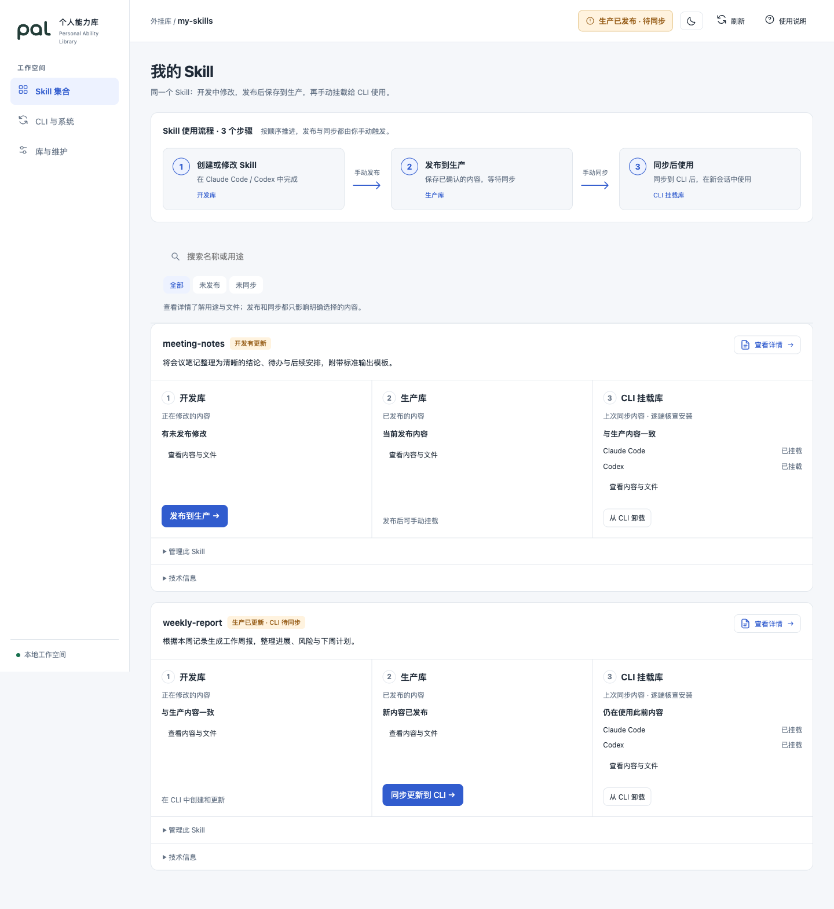

# PAL · 个人能力库

<picture>
  <source media="(prefers-color-scheme: dark)" srcset="docs/brand/pal-wordmark-light.svg">
  
</picture>

**Personal Ability Library**，简称 **PAL**，也有“伙伴”之意。

沉淀经验，打磨能力，让已有积累持续服务于新的工作。

PAL 帮你管理一套 Claude Code 与 Codex 共用的 Skill 库。在熟悉的 CLI 中创建、更新和使用，
在本地 Web 控制台查看内容、发布、挂载和维护。开发中的修改与正在使用的内容相互独立，
什么时候发布、什么时候交给 CLI 使用，由你决定。

当前版本 **0.3.0**，采用 [MIT 许可证](LICENSE)。命令、包名和插件标识统一使用 PAL，
配置路径使用 PAL 专属目录。

## 可以做什么

- 在 Claude Code 或 Codex 内创建、更新同一个 Skill，一次形成双端所需的共享或定向产物。
- 保存完整 Skill 目录，包括说明、参考资料、脚本、模板和二进制资源。
- 对照开发、生产和 CLI 挂载内容，逐项发布、挂载、卸载、放弃修改或删除。
- 在本地控制台浏览文件，检查安装状态，更新系统创建入口，恢复未完成操作。



截图使用示例数据。PAL 当前管理 Skill；日常使用记录、分析、评分和自动能力迭代尚未开放。

## 开始使用

先安装并配置 Claude Code 与 Codex。PAL 提供自带 Python 的运行包：从
[GitHub Releases](https://github.com/Y2ggg/pal/releases) 下载匹配系统和 CPU 的文件，解压后安装：

| 系统 | 文件 | 安装命令（在解压目录执行） |
|---|---|---|
| Windows x64 | `pal-0.3.0-windows-x86_64.zip` | `powershell -NoProfile -ExecutionPolicy Bypass -File .\install.ps1` |
| macOS Apple Silicon / Intel | `pal-0.3.0-macos-arm64.tar.gz` / `pal-0.3.0-macos-x86_64.tar.gz` | `sh install.sh` |
| Linux x64 | `pal-0.3.0-linux-x86_64.tar.gz` | `sh install.sh` |

macOS/Linux 的命令目录为 `~/.local/bin`，请加入 PATH；Windows 安装器设置当前用户 PATH，
新开终端生效。随后运行 `pal --version` 和 `pal quickstart`。
运行包未做 Apple 公证或 Windows 签名；系统要求、验证边界和卸载见[使用手册](docs/USER-GUIDE.md)。

也可使用 Python 3.11+ 和 [uv](https://docs.astral.sh/uv/getting-started/installation/)
安装源码或 wheel；在源码根目录运行 `uv tool install .`，或：

```sh
uv tool install ./pal-0.3.0-py3-none-any.whl
pal quickstart
```

Quickstart 询问 Skill 库保存位置并确认，建立库和两端系统创建入口，不要求先创建演示 Skill。
保存位置应是独立的空目录、新路径或已有 PAL 库，不要选择程序源码或普通业务项目目录。
如果终端找不到 `pal`，运行 `uv tool update-shell` 并重新打开终端。

随后从任意业务目录启动 `claude` 或 `codex`，在会话中调用系统创建入口：

```text
Codex：$pal-create-skill
Claude Code：/pal:pal-create-skill
```

例如：“创建一个整理会议笔记的 Skill，附带输出模板，保存到开发库。”更新时说明目标 Skill
和修改内容。看到开发提交成功后，内容才正式保存；仅生成文本或关闭会话不等于已经入库。
模型访问与相关费用由你配置的 CLI/provider 承担。已保存内容通过创建入口继续更新，
支持的 Skill 格式及多库选择规则见[使用手册](docs/USER-GUIDE.md)。

## 从创建到使用

| 阶段 | 操作示例 | 完成后的状态 |
|---|---|---|
| 开发库 | “创建／更新这个 Skill” | 保存修改，生产和 CLI 保持原内容 |
| 生产库 | “发布这个 Skill” | 保存可交付内容，CLI 保持原内容 |
| CLI 挂载库 | “把这个 Skill 同步到 CLI” | 将所选生产内容安装到两端 |

可以明确要求“发布并同步这个 Skill”；此前主动卸载的 Skill 需要明确要求“重新挂载”。
也可以打开管理界面逐项操作：

```sh
pal web
```

默认地址为 `http://127.0.0.1:8787/`，服务占用当前终端。同步后**新开 CLI 会话**，从 CLI 的
Skill 列表选择实际调用名。常见格式为 `pal-<库ID>:<SkillID>`，Codex 前加 `$`，Claude Code
前加 `/`；库 ID 不一定等于文件夹名，详见[使用手册](docs/USER-GUIDE.md)。旧会话不会热加载。

- **从 CLI 卸载**保留开发和生产内容，之后可重新挂载。
- **放弃未发布修改**将开发内容恢复到当前生产版。
- **删除 Skill**移除开发和当前生产；仍有挂载时，明确完成 CLI 卸载后退出列表。

卸载不会撤回旧会话已加载的内容，请新开会话确认已停止使用。

Web 支持详情与文件浏览、夜间模式、窄屏和统一操作反馈。它不执行 Skill，也不提供任意历史
回退或批量发布。完整性检查验证三层内容，安装监测另行核查两端；Skill 的实际效果仍需在 CLI
任务中检验。

## 升级与关闭

如果 Web 正在运行，先在另一终端执行 `pal web stop`；没有运行则跳过停止步骤。
运行包用户解压新版，再运行其安装脚本。uv 用户在下载的新源码根目录安装，
或将 `.` 换成本地新版 wheel 路径：

```sh
uv tool install --force --reinstall .
pal web
```

在“CLI 与系统”按提示更新系统创建入口，并新开 CLI 会话。程序升级不会自动发布或同步业务
Skill。`pal --version` 显示版本与构建 ID，旧 Web 服务需要重启。

换端口使用 `pal web --port 8899`；停止时使用 `pal web stop --port 8899`。
关闭网页不会停止服务。仅供本机使用，不应通过代理、隧道或端口转发公开到网络。

## 继续了解

- [快速开始](docs/QUICKSTART.md) · [完整使用手册](docs/USER-GUIDE.md) · [维护命令](docs/MAINTENANCE.md)
- [产品范围与理念](docs/PRODUCT.md) · [架构说明](docs/ARCHITECTURE.md)
- [参与贡献](CONTRIBUTING.md) · [安全与数据说明](SECURITY.md) · [更新记录](CHANGELOG.md)
- [第三方依赖](THIRD-PARTY-NOTICES.md) · [发布流程](docs/RELEASING.md)

PAL 是独立项目，与 Anthropic、OpenAI 没有隶属或官方背书关系。
